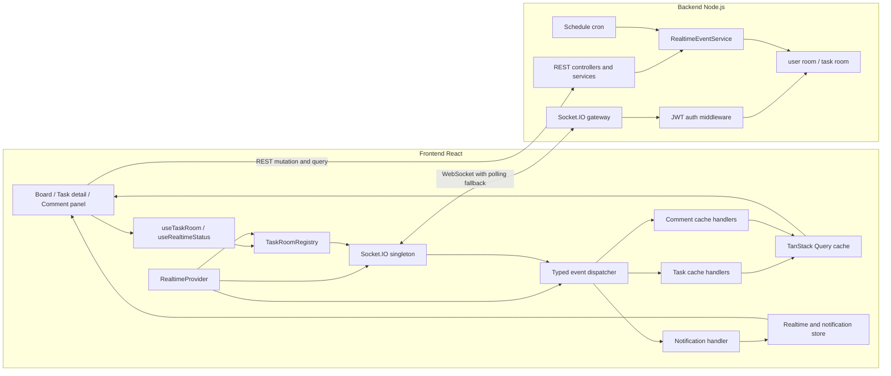
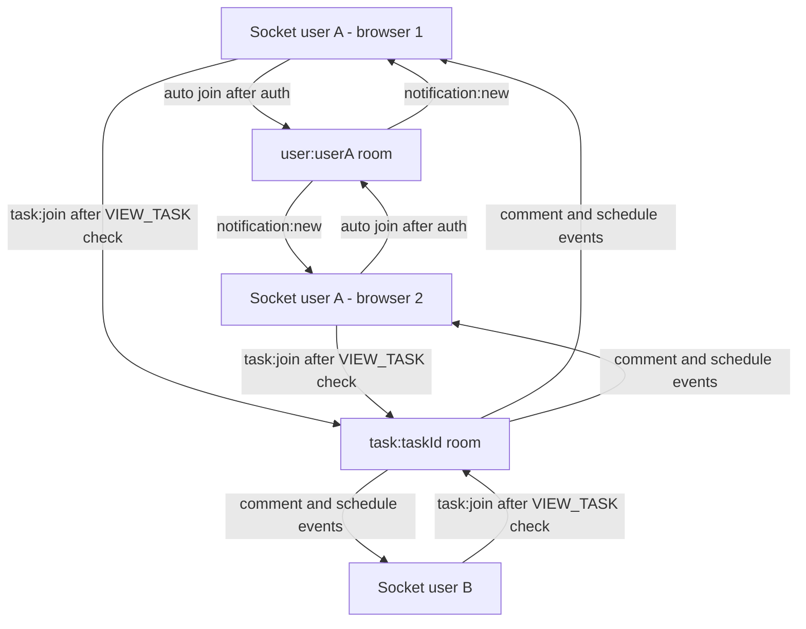
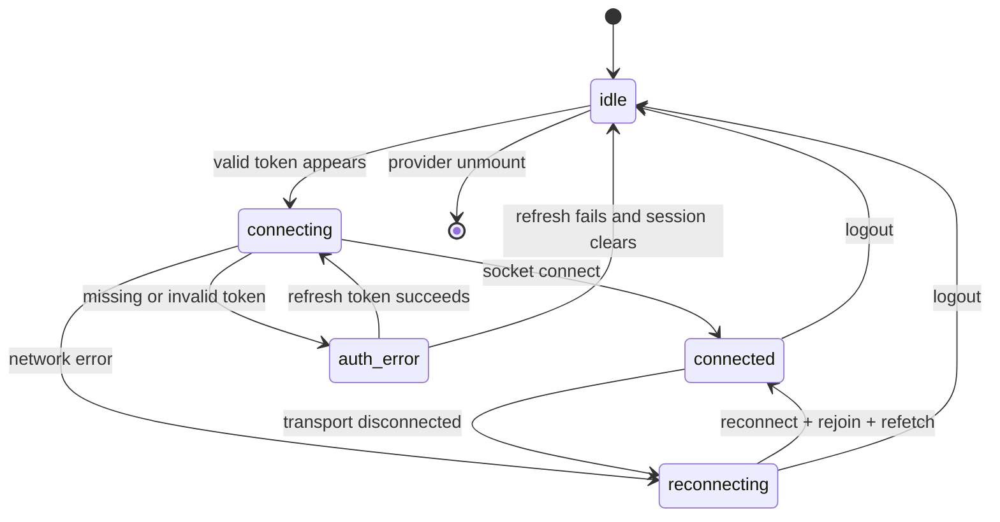

# Kiến trúc Realtime cho Frontend

Kế hoạch triển khai liên kết BE-FE nằm tại realtime-implementation-plan.md trong cùng thư mục. Tài liệu này trả lời “kiến trúc nên như thế nào”; plan mới trả lời “làm gì trước, sửa file nào, gate nào để chuyển phase”.

> Phạm vi: React 19 + TanStack Query + Socket.IO Client trong `FE`, dựa trên contract realtime hiện có ở `Manage -Task/BE/src/modules/realtime`.
>
> Kết luận ngắn: dự án đã có nền realtime cho schedule, nhưng chưa đủ an toàn để mở rộng. Hướng đúng là giữ HTTP làm kênh command, dùng Socket.IO làm kênh event, đăng ký listener đúng một lần ở `RealtimeProvider`, quản lý room tách biệt với component, và cập nhật TanStack Query bằng reducer idempotent.

## 1. Mục tiêu

Realtime cần giải quyết bốn nhu cầu:

1. Khi một người tạo, sửa, xoá comment/reply, các client đang mở cùng task thấy thay đổi ngay.
2. Khi schedule của task thay đổi hoặc cron chuyển task sang `due_soon` / `overdue_locked`, task card và task detail đồng bộ.
3. Notification theo user chỉ hiển thị một lần, không phụ thuộc task detail có đang mở hay không.
4. Sau refresh token, mất mạng, reconnect hoặc logout, socket và cache vẫn đúng, không rò dữ liệu giữa hai phiên đăng nhập.

Ngoài phạm vi FE thuần ở giai đoạn đầu:

- Đồng bộ realtime toàn bộ board cho create/update/move/delete task, tag, assignment, list và board. BE hiện chưa phát các event này.
- Lưu lịch sử notification. BE hiện chỉ push `notification:new`, chưa thấy API inbox/history trong phạm vi đã đọc.
- Đảm bảo không mất event tuyệt đối. Socket.IO hiện không có event log/replay, vì vậy reconnect phải refetch dữ liệu.

## 2. Hiện trạng dự án

### 2.1 Backend đã có

Socket.IO chạy chung HTTP server và dùng cùng CORS:

- Handshake nhận access token qua `socket.handshake.auth.token` hoặc cookie.
- Middleware verify JWT và chỉ chấp nhận user `ACTIVE`.
- Mỗi socket tự động join `user:{userId}`.
- Client có thể `task:join` / `task:leave`.
- Trước khi join task room, BE kiểm tra task, list, board còn active và user có quyền `VIEW_TASK`.
- Comment controller và task schedule service emit sau khi mutation DB thành công.

Các file nguồn chính:

- `Manage -Task/BE/src/modules/realtime/realtime.types.ts`
- `Manage -Task/BE/src/modules/realtime/socket.server.ts`
- `Manage -Task/BE/src/modules/realtime/socket-auth.middleware.ts`
- `Manage -Task/BE/src/modules/realtime/task-comment.socket.ts`
- `Manage -Task/BE/src/modules/realtime/realtime-event.service.ts`

### 2.2 Frontend đã có

- Đã cài `socket.io-client`.
- `src/features/realtime/socket.ts` tạo singleton socket, có reconnect và gửi JWT trong handshake.
- `useGlobalRealtime()` được mount ở `App.tsx`.
- `useTaskSocket(taskId)` được mount khi task detail mở.
- `useAutoJoinVisibleTaskRooms()` được mount ở board DnD provider.
- Event schedule đã cập nhật một phần task cache.
- Comment cache đã có các helper append/replace/remove, nhưng chưa có socket listener.

### 2.3 Khoảng trống và rủi ro cần xử lý trước

| Mức | Vấn đề hiện tại | Hậu quả |
| --- | --- | --- |
| P0 | Sau reconnect, `roomRefcounts` vẫn lớn hơn 0 nên `onConnect -> joinTaskRoom()` không emit `task:join` lại | Socket connected nhưng không còn ở task room, client ngừng nhận event mà UI không báo lỗi |
| P0 | Logout chỉ xoá token/query cache, không gọi `disconnectSocket()` | Socket cũ có thể vẫn nhận event của user trước |
| P0 | Login/verify/refresh token ghi trực tiếp localStorage; realtime chỉ poll mỗi 30 giây | Kết nối sau login chậm, token socket không đồng bộ chắc chắn |
| P0 | `notification:new` được listen bên trong từng `useTaskSocket` | Mở nhiều consumer có thể tạo toast trùng; đóng task detail thì notification có thể không được xử lý |
| P0 | FE chưa khai báo và xử lý 6 comment events mà BE đã emit | Comment giữa hai browser chưa realtime |
| P0 | Reply create/delete hiện cập nhật item và `replyCount` bằng hai thao tác độc lập | HTTP success và socket echo có thể tăng/giảm `replyCount` hai lần |
| P1 | `useAutoJoinVisibleTaskRooms()` quét toàn bộ task-list cache, không chỉ board đang hiển thị | Join thừa room cũ, nhiều lần kiểm tra permission và khó scale |
| P1 | `task:due_soon` và `task:overdue_locked` patch list không xét filter | Task có thể còn nằm sai cache `scheduleState` |
| P1 | `replaceTaskAcrossCaches()` đang dùng `old ?? task` cho detail cache | Detail đã có cache sẽ không được thay bằng payload mới |
| P1 | Task detail giữ thêm một bản `selectedTask` ngoài TanStack Query | Phải sync tay, dễ có hai nguồn dữ liệu khác nhau |
| P1 | Contract FE dùng `unknown`, thiếu comment event và thiếu `createdAt` của notification | TypeScript không bảo vệ được contract BE/FE |
| P2 | Mất kết nối không có refetch bù event bị lỡ | Cache có thể cũ dù socket đã reconnect thành công |
| P2 | URL socket suy ra bằng cách cắt `/api` từ `VITE_API_URL` | Dễ sai khi deploy qua gateway, sub-path hoặc Socket.IO path riêng |

## 3. Nguyên tắc kiến trúc

1. **HTTP là command, Socket.IO là event.** Create/update/delete tiếp tục gọi REST API. Socket chỉ truyền kết quả đã commit để đồng bộ client khác.
2. **TanStack Query là nguồn dữ liệu server duy nhất.** Component không giữ một bản task/comment riêng nếu có thể đọc từ query cache.
3. **Listener được đăng ký đúng một lần.** `RealtimeProvider` là owner duy nhất của server event listeners và notification toast.
4. **Component chỉ yêu cầu room.** `useTaskRoom(taskId)` acquire/release subscription; component không tự `socket.on()`.
5. **Reducer phải idempotent.** Cùng một mutation có thể tới client qua HTTP response và socket echo. Apply hai lần vẫn phải cho cùng kết quả.
6. **Reconnect gồm hai bước: rejoin và reconcile.** Rejoin room khôi phục stream tương lai; invalidate/refetch khôi phục event đã lỡ.
7. **Auth lifecycle điều khiển socket lifecycle.** Login connect, token refresh cập nhật handshake auth, logout disconnect và reset room state.
8. **Không dùng task room fan-out làm kiến trúc board dài hạn.** Board realtime cần `board:{boardId}` từ BE.

## 4. Kiến trúc tổng thể đề xuất



Luồng dữ liệu có chủ đích:

```text
User action -> REST mutation -> DB commit -> HTTP response -> update local cache
                                      |
                                      +-> Socket event -> update every subscribed cache
```

Client tạo mutation cũng nhận socket echo vì BE emit tới cả task room. Do đó không được dựa vào giả định “event chỉ dành cho user khác”.

## 5. Topology room hiện tại và mục tiêu

### 5.1 Contract hiện tại có thể dùng ngay



- `user:{userId}`: BE tự join, FE không emit join. Dùng cho notification cá nhân.
- `task:{taskId}`: FE phải request, BE kiểm tra `VIEW_TASK`. Dùng khi task detail/comment panel đang active.

### 5.2 Board realtime mục tiêu cần BE bổ sung

Để toàn bộ board live-update mà không join hàng trăm task room, BE nên thêm:

```text
Client -> board:join { boardId }
Server -> kiểm tra VIEW_BOARD hoặc quyền tương đương
Server -> socket.join("board:" + boardId)
```

Sau đó emit task summary event tới `board:{boardId}`:

- `task:created`
- `task:updated`
- `task:moved`
- `task:deleted`
- `task:assignments_updated`
- `task:tags_updated`
- `list:created`, `list:updated`, `list:moved`, `list:deleted`

Cho đến khi BE có board room, `useBoardTaskRooms(activeTaskIds)` chỉ là giải pháp chuyển tiếp: nhận chính xác IDs thuộc board đang mount, không quét mọi query cache, đo số room và thời gian join, rồi loại bỏ khi board room sẵn sàng.

## 6. Cấu trúc source đề xuất

```text
src/features/realtime/
├── contracts/
│   └── realtime-events.ts       # Full typed contract mirror từ BE
├── client/
│   ├── socket-client.ts         # Khởi tạo singleton, URL, transport, auth
│   └── connection-state.ts      # Map socket lifecycle thành trạng thái UI
├── rooms/
│   └── task-room-registry.ts    # desired refs và actual joined rooms
├── handlers/
│   ├── task-event-handlers.ts   # Event task/schedule -> task cache
│   ├── comment-event-handlers.ts # Event comment -> infinite query cache
│   └── notification-handler.ts  # Store + toast một lần
├── providers/
│   └── realtime-provider.tsx    # Auth lifecycle + register listeners một lần
├── hooks/
│   ├── use-task-room.ts         # acquire/release task room
│   ├── use-board-task-rooms.ts  # Tạm thời, chỉ active board
│   └── use-realtime-status.ts   # read-only status cho UI
├── stores/
│   └── realtime-store.ts        # connection status, optional notifications
└── index.ts
```

Phân quyền ownership:

| Module | Được làm | Không được làm |
| --- | --- | --- |
| `socket-client` | Tạo/kết nối/ngắt socket, cập nhật auth | Gọi toast, sửa query cache, hiểu task/comment |
| `task-room-registry` | Giữ desired refs, join/leave/rejoin, ack timeout | Đăng ký business event listener |
| `RealtimeProvider` | Theo dõi auth, đăng ký listener một lần, điều phối reconnect | Render task business UI |
| `handlers/*` | Chuyển typed event thành cache/store action | Tạo socket hoặc điều khiển component |
| `useTaskRoom` | Acquire/release theo lifecycle React | Tự `socket.on()` |
| Component | Dùng query data và trạng thái connection | Sửa room map hoặc parse raw payload |

Không tạo một “god hook” tương tự `useTaskSocket.ts` hiện tại. File này đang gộp transport, auth polling, room refcount, listener, cache reducer, selected task sync và toast vào cùng một nơi.

## 7. Contract event FE

FE cần mirror đầy đủ `ServerToClientEvents` từ BE. Date đi qua JSON nên type FE phải là ISO string, không phải `Date`.

| Event | Room | Payload chính | Handler FE |
| --- | --- | --- | --- |
| `task:comment_created` | task | `taskId`, `comment` | Insert root comment nếu ID chưa tồn tại |
| `task:comment_replied` | task | `taskId`, `parentCommentId`, `reply` | Insert reply và tăng count trong một reducer atomic |
| `task:comment_updated` | task | `taskId`, `comment` | Replace root theo ID và `updatedAt` |
| `task:comment_reply_updated` | task | `taskId`, `parentCommentId`, `reply` | Replace reply theo ID và `updatedAt` |
| `task:comment_deleted` | task | `taskId`, `commentId`, `comment`, `deletedReplyIds?` | Remove root; remove replies query/cache liên quan |
| `task:comment_reply_deleted` | task | `taskId`, `parentCommentId`, `replyId`, `reply` | Remove reply và giảm count chỉ khi reply thực sự tồn tại |
| `task:schedule_updated` | task | `taskId`, full `task` | Replace task ở detail và mọi list cache phù hợp filter |
| `task:rescheduled` | task | `taskId`, full `task` | Cùng reducer full task; toast nếu product yêu cầu |
| `task:unlocked` | task | `taskId`, full `task` | Cùng reducer full task |
| `task:due_soon` | task | `taskId`, `dueDate`, `reminderAt` | Patch tối thiểu + reconcile filtered queries |
| `task:overdue_locked` | task | `taskId`, due/lock fields | Patch tối thiểu + reconcile filtered queries |
| `notification:new` | user | `type`, `title`, `body`, `data`, `createdAt` | Store/toast ở provider, đúng một listener |

Type khung:

```ts
type RealtimeAck = { success: boolean; error?: string };

type ClientToServerEvents = {
  "task:join": (
    payload: { taskId: string },
    ack?: (result: RealtimeAck) => void,
  ) => void;
  "task:leave": (
    payload: { taskId: string },
    ack?: (result: RealtimeAck) => void,
  ) => void;
};

type ServerToClientEvents = {
  "task:comment_created": (payload: {
    taskId: string;
    comment: TaskComment;
  }) => void;
  "task:comment_replied": (payload: {
    taskId: string;
    parentCommentId: string;
    reply: TaskComment;
  }) => void;
  // Mirror các event còn lại trong bảng trên.
};
```

Không import trực tiếp type từ BE qua đường dẫn workspace. FE và BE được build/deploy độc lập. Hướng tốt hơn về sau là sinh contract package/OpenAPI schema riêng; trước mắt mirror type và thêm contract test.

## 8. Connection và auth lifecycle

`authStorage` cần thêm cơ chế `subscribe(listener)`. `setToken()` và `clearToken()` phải notify trong cùng tab; event `storage` xử lý thay đổi từ tab khác. Không dùng polling 30 giây.



Luồng cụ thể:

```mermaid
sequenceDiagram
  participant Auth as Auth storage / refresh coordinator
  participant Provider as RealtimeProvider
  participant Socket as Socket client
  participant BE as Socket.IO BE
  participant Rooms as TaskRoomRegistry
  participant Query as TanStack Query

  Auth->>Provider: token changed
  Provider->>Socket: set handshake auth(token)
  Provider->>Socket: connect()
  Socket->>BE: handshake JWT
  BE-->>Socket: connected + auto join user room
  Socket-->>Provider: connect
  Provider->>Rooms: rejoinDesiredRooms()
  Rooms->>BE: task:join with ack + timeout
  BE-->>Rooms: success
  Provider->>Query: invalidate active realtime queries after rejoin

  Note over Socket,BE: Network disconnect; room membership is lost on server
  Socket-->>Provider: disconnect
  Provider->>Rooms: clearActualJoinedOnly()
  Socket->>BE: reconnect with latest token
  BE-->>Socket: connected
  Provider->>Rooms: rejoinDesiredRooms()

  Auth->>Provider: logout / token cleared
  Provider->>Socket: disconnect()
  Provider->>Rooms: resetAll()
  Provider->>Query: user flow clears query cache
```

Quy tắc auth:

- App load có valid token: connect ngay.
- Login/verify thành công: `authStorage.setToken()` phát event; provider connect ngay.
- HTTP refresh thành công: cập nhật `socket.auth` ngay để lần reconnect sau dùng token mới.
- Socket handshake báo `Access token expired`: gọi một token refresh coordinator dùng chung với Axios, tránh hai refresh request chạy song song; sau đó connect lại.
- Logout, refresh thất bại hoặc user inactive: disconnect ngay, xoá auth trên socket, reset registry.
- Không cần force reconnect mỗi lần access token refresh nếu socket hiện tại vẫn connected; chỉ cần cập nhật auth cho handshake kế tiếp. Logout luôn phải disconnect.

Nên tách `refreshTokenPromise` đang nằm trong `services/axios.ts` thành `features/auth/services/token-refresh.ts` để Axios và realtime dùng cùng một single-flight promise.

## 9. Room registry đúng cách

Không dùng một map duy nhất để đại diện đồng thời cho “component muốn room” và “server đã join room”. Cần hai trạng thái:

```ts
type TaskRoomRegistryState = {
  desiredRefs: Map<string, number>; // React consumers đang cần room
  joinedOnTransport: Set<string>;  // Room đã ack trên connection hiện tại
};
```

Thuật toán:

1. `acquire(taskId)` tăng ref. Nếu từ 0 lên 1 và socket connected, emit join.
2. Join dùng `socket.timeout(5_000).emit(...)`; chỉ thêm vào `joinedOnTransport` khi ack success.
3. `release(taskId)` giảm ref. Khi về 0, xoá desired ref và emit leave nếu đang joined.
4. `disconnect` chỉ clear `joinedOnTransport`; giữ `desiredRefs` vì component vẫn mounted.
5. `connect` iterate mọi `desiredRefs > 0` và emit join. Tuyệt đối không tăng ref trong reconnect handler.
6. `logout/reset` clear cả hai collection.
7. Join lỗi `Forbidden` hoặc `Task not found`: xoá actual joined; không phá ref của consumer khác. Expose lỗi có kiểm soát, không spam toast mỗi reconnect.

Thiết kế này cũng an toàn với React StrictMode: mount/acquire, cleanup/release, remount/acquire sẽ hội tụ về ref đúng.

## 10. Chiến lược cập nhật cache

### 10.1 Full task event

`task:schedule_updated`, `task:rescheduled`, `task:unlocked` trả full `TaskResponse`. Dùng một hàm canonical:

```ts
replaceTaskAcrossCaches(queryClient, task);
queryClient.setQueryData(taskKeys.detail(task.id), task);
```

Cần sửa `replaceTaskAcrossCaches()` từ `(old) => old ?? task` thành luôn ghi task mới. List cache tiếp tục dùng filter-aware replacement hiện có.

### 10.2 Partial task event

`task:due_soon` và `task:overdue_locked` không trả full task. Có hai lựa chọn:

- Giai đoạn đầu, ưu tiên đúng dữ liệu: patch các field chắc chắn, sau đó invalidate `taskKeys.detail(taskId)` và các active list query liên quan.
- Khi muốn giảm request: thêm `patchTaskAcrossCaches(taskId, patch)` và bắt buộc chạy lại `matchesFilters()` cho từng list cache.

Không dùng `setQueriesData()` map mù trên tất cả task list vì task có thể phải rời cache `scheduled` và đi vào cache `due_soon`.

### 10.3 Comment và reply event

Các helper cần atomic và trả về trạng thái có thay đổi hay không:

```ts
insertReplyIfAbsent(...) -> { inserted: boolean }
removeReplyIfPresent(...) -> { removed: boolean }
```

- Chỉ tăng `replyCount` khi `inserted === true`.
- Chỉ giảm `replyCount` khi `removed === true`.
- Root create theo comment ID là idempotent.
- Update chỉ nhận payload mới hơn hoặc bằng `updatedAt` hiện tại.
- Root delete phải remove root và `removeQueries(taskCommentKeys.replies(taskId, commentId))`.
- Event đến khi query chưa load: không cần tạo một InfiniteData giả thiếu pagination. Mark query stale/invalidate; lần mở panel sẽ fetch canonical data.

Điều này giải quyết race phổ biến:

```text
socket echo đến trước HTTP response
HTTP response đến trước socket echo
event update đến sau event delete
reconnect refetch chạy cùng lúc event mới
```

### 10.4 Selected task

Mục tiêu dài hạn: `TaskDetailContext` chỉ giữ `selectedTaskId` và trạng thái dialog; task data được đọc từ `useQuery(taskKeys.detail(id))`. Như vậy không cần `queryCache.subscribe()` và `updateSelectedTask()` để đồng bộ một bản sao local.

Trong migration ngắn hạn, handler vẫn có thể update query cache rồi bridge sang `selectedTask`, nhưng không để business listener phụ thuộc context của task detail.

## 11. Event dispatch và listener lifecycle

`RealtimeProvider` register mỗi listener một lần trong một effect ổn định:

```ts
useEffect(() => {
  const socket = getSocket();

  const onCommentCreated = (payload: CommentCreatedPayload) =>
    applyCommentCreated(queryClient, payload);

  socket.on("task:comment_created", onCommentCreated);
  // register các event khác

  return () => {
    socket.off("task:comment_created", onCommentCreated);
    // off bằng đúng function reference
  };
}, [queryClient]);
```

Không dùng `socket.off("event")` không kèm callback vì có thể xoá listener thuộc module khác. Không đăng ký `notification:new` trong task hook.

`useTaskRoom` chỉ còn:

```ts
export function useTaskRoom(taskId: string | null, enabled = true) {
  useEffect(() => {
    if (!taskId || !enabled) return;
    taskRoomRegistry.acquire(taskId);
    return () => taskRoomRegistry.release(taskId);
  }, [taskId, enabled]);
}
```

## 12. Notification

Phase đầu có thể chỉ dùng Sonner, nhưng listener phải ở provider. Nếu cần notification center, dùng Zustand đã có trong dependencies:

```ts
type RealtimeNotification = {
  id: string;
  type: TaskNotificationType;
  title: string;
  body: string;
  data: Record<string, unknown>;
  createdAt: string;
  read: boolean;
};
```

BE payload hiện không có notification ID. FE có thể dedupe tạm bằng hash `type + taskId + createdAt`; giải pháp chuẩn là BE thêm `notificationId` hoặc `eventId`.

Toast policy:

- Chỉ provider gọi toast cho `notification:new`.
- Không toast cho mọi cache event; thay đổi nội dung trực tiếp là đủ.
- Nếu actor nhận cả task event và notification cho cùng action, chỉ notification tạo toast.
- Click toast có `data.taskId` thì điều hướng/mở task detail nếu user còn quyền.

## 13. Full-board realtime và contract BE nên bổ sung

FE hiện không thể tự tạo realtime cho task name, description, move, delete, assignment, status hoặc tag nếu BE không emit. Contract mục tiêu nên dùng envelope thống nhất:

```ts
type RealtimeEnvelope<T> = {
  eventId: string;
  occurredAt: string;
  actorId: string | null;
  boardId: string;
  entityId: string;
  version: number;
  data: T;
};
```

Lợi ích:

- `eventId` để dedupe.
- `version` để bỏ event cũ đến sai thứ tự.
- `actorId` để điều chỉnh UX cho action của chính mình mà không dựa vào timing.
- `boardId` để route event và kiểm tra cache đúng scope.
- `occurredAt` cho log và notification ordering.

Đề xuất emit full task snapshot cho `task:created/updated`, payload move riêng cho `task:moved`, và ID/tombstone cho `task:deleted`. Với quy mô hiện tại, full snapshot đơn giản và ít bug hơn patch field động.

## 14. Reliability, security và deployment

### Reliability

- Socket event hiện là transient: không có replay, offset hay persistence.
- Sau mỗi reconnect thành công và rejoin room, invalidate các task/comment query đang active để lấp khoảng trống.
- Dùng ack timeout cho join/leave; retry join với backoff có giới hạn.
- Theo dõi `window.online/offline`; trạng thái offline không nên báo auth error.
- Khi tab quay lại foreground sau thời gian dài, kiểm tra token và invalidate active realtime query.
- Event handler phải không throw ra ngoài callback; log có context event/task ID.

### Security

- Không đưa token vào query string hoặc log.
- Luôn để BE kiểm tra quyền room; FE chỉ ẩn UX, không phải authorization boundary.
- Logout phải disconnect trước hoặc cùng lúc clear user cache.
- Khi permission thay đổi, BE cần evict socket khỏi board/task room hoặc event handler cần từ chối ở lần rejoin; đây là dependency BE.
- Payload socket là input từ network. TypeScript không validate runtime. Có thể dùng Zod tại boundary cho event quan trọng nếu backend contract còn thay đổi thường xuyên.

### Deployment

- Thêm `VITE_SOCKET_URL`, không bắt buộc suy ra từ `VITE_API_URL`.
- Có thể thêm `VITE_SOCKET_PATH` nếu gateway không dùng mặc định `/socket.io`.
- Reverse proxy phải forward HTTP Upgrade cho Socket.IO path và giữ CORS credentials đúng origin.
- Nếu chạy nhiều BE instance, in-memory rooms chỉ thấy socket của từng instance. Cần Socket.IO Redis adapter; nếu vẫn bật polling thì load balancer cần sticky session theo hướng dẫn hạ tầng.
- Giữ polling fallback trừ khi hạ tầng bảo đảm WebSocket hoàn toàn.

Env đề xuất:

```env
VITE_API_URL=http://localhost:3000/api
VITE_SOCKET_URL=http://localhost:3000
VITE_SOCKET_PATH=/socket.io
```

Vite dev proxy hiện chỉ proxy `/api`; nếu muốn same-origin socket trong local dev, phải thêm proxy `/socket.io` với `ws: true`, hoặc để `VITE_SOCKET_URL` trỏ thẳng BE.

## 15. Kế hoạch triển khai theo phase

### Phase 0 - Chốt contract và test cases

Mục tiêu: FE và BE thống nhất event đang có trước khi refactor.

- Tạo `contracts/realtime-events.ts`, mirror đủ 12 server events và 2 client events.
- Ghi rõ field Date được serialize thành string.
- Lập fixtures cho task, root comment, reply và notification.
- Viết bảng manual test hai browser cho comment/schedule/auth/reconnect.

Hoàn thành khi TypeScript không còn `task: unknown` và mọi event BE hiện có đều xuất hiện trong FE contract.

### Phase 1 - Sửa nền socket và auth (P0)

- Tách `socket.ts` thành `socket-client`, `task-room-registry`, `RealtimeProvider`.
- Thêm auth subscription; xoá polling 30 giây.
- Kết nối ngay sau login/verify; update auth sau refresh; disconnect/reset khi logout.
- Tách `desiredRefs` khỏi `joinedOnTransport` và rejoin đúng sau reconnect.
- Đưa `notification:new` lên provider để chỉ có một listener.
- Expose trạng thái `idle/connecting/connected/reconnecting/offline/auth_error`.

Hoàn thành khi refresh trang, bật/tắt mạng, refresh token, logout/login user khác đều không tạo listener trùng hoặc dùng session cũ.

### Phase 2 - Task schedule cache correctness

- Đưa schedule handler vào `task-event-handlers.ts`.
- Sửa detail cache luôn nhận full task mới.
- Thêm filter-aware partial patch hoặc invalidate/refetch cho due/overdue.
- Sau reconnect, invalidate active task queries.
- Loại bỏ toast `Task unlocked` khỏi task-level listener nếu notification đã cover action.

Hoàn thành khi hai browser cùng mở task và các cache `scheduled`, `due_soon`, `overdue_locked` tự di chuyển task đúng filter.

### Phase 3 - Comment realtime

- Đăng ký đủ 6 comment events ở provider.
- Refactor comment helper thành reducer atomic/idempotent.
- Xử lý root/reply create, update, delete và pagination chưa load.
- Không toast cho content update; UI tự render dữ liệu mới.
- Refetch active comments sau reconnect.

Hoàn thành khi HTTP response và socket echo theo bất kỳ thứ tự nào cũng không tạo comment trùng hoặc sai `replyCount`.

### Phase 4 - Thu hẹp room fan-out trên board

- Thay `useAutoJoinVisibleTaskRooms()` đang quét toàn cache bằng hook nhận IDs chính xác của active board.
- Ghi metric/dev log số desired/joined rooms và join failures.
- Không subscribe task ở board khác chỉ vì query cache còn giữ data.
- Chốt với BE `board:join/leave` và board event contract.

Hoàn thành khi chuyển board release đúng task rooms và reconnect chỉ rejoin room của màn hình hiện tại.

### Phase 5 - Board room và event envelope

Phase này có dependency BE.

- BE thêm permission-aware board room.
- BE emit create/update/move/delete task và list/tag/assignment events cần thiết.
- FE thêm `useBoardRoom(boardId)` và board cache reducers.
- Thêm `eventId`/`version` để dedupe và ordering.
- Xoá giải pháp join N task rooms ở board; chỉ task detail tiếp tục join task room cho comment chi tiết.

Hoàn thành khi hai browser cùng một board thấy task/list thay đổi đầy đủ mà mỗi browser chỉ giữ một board room cộng task room đang mở.

## 16. Thứ tự file cần thay đổi

| Thứ tự | File | Thay đổi |
| --- | --- | --- |
| 1 | `src/features/realtime/contracts/realtime-events.ts` | Tạo typed event contract đầy đủ |
| 2 | `src/features/auth/storage/auth-storage.ts` | Thêm subscribe/notify cho token lifecycle |
| 3 | `src/features/auth/services/token-refresh.ts` | Tách single-flight refresh dùng chung |
| 4 | `src/services/axios.ts` | Dùng refresh coordinator mới |
| 5 | `src/features/realtime/client/socket-client.ts` | Transport singleton và latest auth |
| 6 | `src/features/realtime/rooms/task-room-registry.ts` | Acquire/release/rejoin/ack timeout |
| 7 | `src/features/realtime/handlers/task-event-handlers.ts` | Full/partial task reducers |
| 8 | `src/features/tasks/hooks/comment-cache.ts` | Atomic idempotent comment reducers |
| 9 | `src/features/realtime/handlers/comment-event-handlers.ts` | Map 6 comment events vào reducers |
| 10 | `src/features/realtime/providers/realtime-provider.tsx` | Listener và auth/reconnect lifecycle |
| 11 | `src/features/realtime/hooks/use-task-room.ts` | Room lifecycle hook mỏng |
| 12 | `src/App.tsx` | Mount `RealtimeProvider` một lần |
| 13 | `src/components/tasks/task-detail-content.tsx` | Dùng `useTaskRoom`, bỏ `useTaskSocket` cũ |
| 14 | `src/components/boards/board-dnd-provider.tsx` | Bỏ scan toàn query cache, dùng active IDs tạm thời |
| 15 | `src/features/tasks/utils/task-cache.ts` | Fix detail replace và partial filter-aware update |
| 16 | `.env.example`, `vite.config.ts` | Socket URL/path và optional WebSocket proxy |

Không nên sửa tất cả trong một commit. Mỗi phase cần build được và giữ backward compatibility trong lúc migration; provider mới có thể dùng socket singleton cũ trước khi thay registry.

## 17. Test strategy

Repo chưa có script test. Tối thiểu nên thêm Vitest cho pure reducer/registry; E2E có thể làm sau.

### Unit test bắt buộc

- `acquire` hai lần chỉ join server một lần.
- `release` một trong hai consumer chưa leave server.
- Disconnect clear actual rooms nhưng giữ desired refs.
- Reconnect emit join lại mà không tăng refcount.
- Join timeout/failure không đánh dấu joined.
- Comment created apply hai lần chỉ có một item.
- Reply created apply hai lần chỉ tăng count một lần.
- Reply deleted apply hai lần chỉ giảm count một lần.
- Event update cũ hơn không ghi đè event mới hơn.
- Full task event đưa task vào/rời đúng filtered list cache.
- Due/overdue partial event làm cache active được reconcile.

### Integration test

- Provider chỉ register một listener/event dưới React StrictMode.
- Token set -> connect; token clear -> disconnect.
- Refresh token -> reconnect kế tiếp dùng token mới.
- `notification:new` chỉ tạo một toast dù task detail đang mở.
- Reconnect -> rejoin -> invalidate active task/comment queries theo đúng thứ tự.

### Manual test hai browser

1. Hai user có quyền cùng mở một task; A tạo/sửa/xoá comment và reply; B cập nhật ngay.
2. A reschedule; B thấy task card, detail và filter thay đổi đúng.
3. Trigger cron due soon/overdue; cả task-room event và user notification hoạt động, không toast trùng.
4. Ngắt mạng B, A tạo comment, nối mạng B; B refetch và thấy comment bị lỡ.
5. Refresh access token trong lúc socket connected, sau đó buộc reconnect; handshake thành công bằng token mới.
6. Logout A rồi login user C trong cùng tab; C không nhận notification/room của A.
7. Chuyển board liên tục; số desired/joined room trở về đúng scope active.
8. User mất `VIEW_TASK`; join/rejoin bị từ chối và UI không loop toast.

## 18. Definition of Done

Realtime FE được xem là hoàn thành cho contract hiện tại khi:

- Có một socket instance và một global listener owner.
- Không còn auth polling 30 giây.
- Logout luôn disconnect và reset rooms.
- Reconnect rejoin đúng mọi room còn desired và refetch dữ liệu có thể bị lỡ.
- FE type đủ toàn bộ event BE; không còn payload `unknown`.
- Schedule cập nhật đúng detail, board card và filtered caches.
- Sáu comment events hoạt động; không duplicate và không sai reply count khi nhận socket echo.
- Notification chỉ xử lý một lần ở app root.
- Board hiện tại không join task room từ cache của board cũ.
- Build/lint không phát sinh lỗi mới.
- Có unit test cho room registry và idempotent cache reducers.

## 19. Quyết định khuyến nghị

Triển khai Phase 0 đến Phase 3 trước vì hoàn toàn dựa trên contract BE đang có và giải quyết các lỗi P0. Phase 4 chỉ là bước giảm rủi ro tạm thời. Phase 5 là kiến trúc đích cho collaboration toàn board và cần BE phối hợp.

Không mở rộng trực tiếp `useTaskSocket.ts` hiện tại. Refactor ownership trước, sau đó thêm comment handlers. Nếu thêm event mới vào hook hiện tại ngay, số listener, reconnect bug và auth lifecycle sẽ càng khó kiểm soát.
